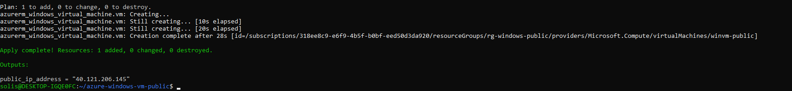

# Project 15 – Deploy a Public Azure Windows VM with RDP

This project provisions a publicly accessible Windows Server virtual machine in Azure using Terraform. The VM includes a public IP and an open RDP port (3389) via a network security group.

## 🔧 What This Deploys

- A new **Resource Group**
- A **Virtual Network** and **Subnet**
- A **Public IP Address** (static)
- A **Network Interface** associated with a **Network Security Group**
- A **Windows Server 2019 VM**
- Inbound RDP access on port **3389**

## ✅ Key Features

- Public IP for remote access
- Secure RDP-only inbound rule
- Password authentication for testing/demo
- Ready for Bastion or Jump Box integration

## 🔐 Output

```hcl
public_ip_address = "YOUR_PUBLIC_IP"
```

## 📸 Screenshot



## 🧠 Knowledge Check

1. What port is required for RDP?
2. Why use `Static` for the Public IP?
3. What is a use case for public-facing Windows VMs?
4. How would you secure this VM in production?

## 🚀 Commands Used

```bash
terraform init
terraform apply -auto-approve
```

## 💡 Notes

- VM name shortened to `winvm-public` to meet Windows 15-char limit
- Core quota must be available to deploy
- Public IPs are limited — clean up after use

